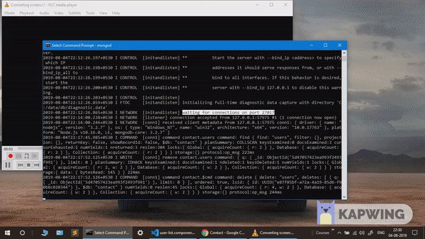

<h1 align="center">welcome to contact-management 👋</h1>
<p>
  
  
</p>

> contact management system - implementation of CRUD operation using MEAN stack.

## 👀 demo


## 🛠 usage

### setting up back-end
```sh
$ git clone https://github.com/alok722/contact-management.git

$ cd backend

$ npm i

$ npm run start
```

### setting up front-end
```sh
$ git clone https://github.com/alok722/contact-management.git

$ cd frontend

$ npm i

$ npm run start
```

## 👤 author

 **Alok raj (alokr417@gmail.com)**

* website: https://alokraj.tech/
* github: [@alok722](https://github.com/alok722)
* linkedin: [@alok722](https://linkedin.com/in/alok722)


## 🤝 contributing

contributions, issues and feature requests are welcome!

## 🙌 show your support

give a ⭐️ if this project helped you!


***
